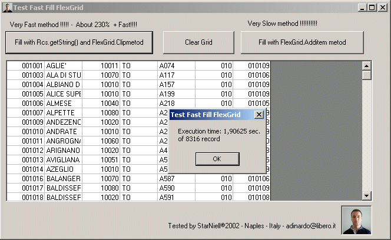



## \_A Fast Fill FlexGrid by Recordset ADO

### Description

Fill a FlexGrid without ADODC control and without AddItem of FlexGrid Method, with a fasted time about 230% more... with Recordset.GetString() and FlexGrid.Clip methods
 
### More Info
 
Required ADO 2.7 and FlexGrid Control, small know of ADO and VB Language.

             |
---                |---
**Submitted On**   |2002-09-27 12:18:10
**By**             |[StarNiell](https://github.com/Planet-Source-Code/PSCIndex/blob/master/ByAuthor/starniell.md)
**Level**          |Beginner
**User Rating**    |4.6 (147 globes from 32 users)
**Compatibility**  |VB 5\.0, VB 6\.0
**Category**       |[Databases/ Data Access/ DAO/ ADO](https://github.com/Planet-Source-Code/PSCIndex/blob/master/ByCategory/databases-data-access-dao-ado__1-6.md)
**World**          |[Visual Basic](https://github.com/Planet-Source-Code/PSCIndex/blob/master/ByWorld/visual-basic.md)
**Archive File**   |[Fast\_Fill\_1370549272002\.zip](https://github.com/Planet-Source-Code/starniell-a-fast-fill-flexgrid-by-recordset-ado__1-39309/archive/master.zip)

